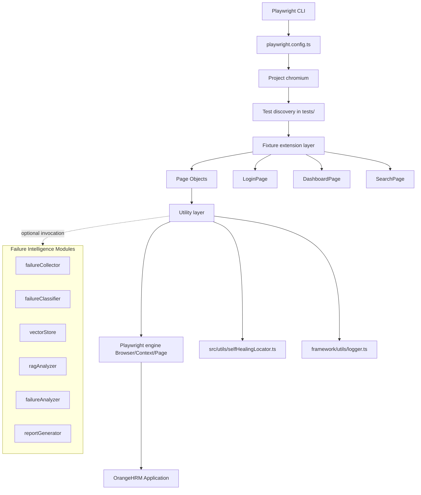
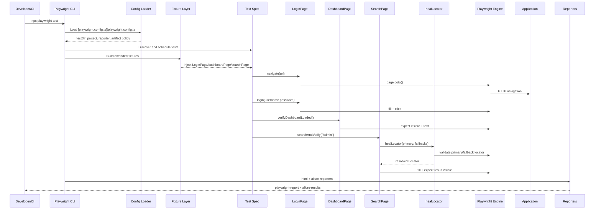

# goCometUI Framework Architecture Report

## 1. Scope and Baseline
This report analyzes the UI automation framework under goCometUI, including runtime code, test assets, and CI/CD integration. It is based on the current implementation in these entry points:
- [playwright.config.ts](playwright.config.ts#L3)
- [framework/fixtures/testfixtures.ts](framework/fixtures/testfixtures.ts#L16)
- [tests/search/search.spec.ts](tests/search/search.spec.ts#L5)

## 2. Repository Structure and Responsibilities

### 2.1 Top-Level Folders

| Folder | Purpose | Responsibilities | Dependencies | Runtime Use |
|---|---|---|---|---|
| goCometUI/.github/workflows | CI workflows | Build, test, publish artifacts, notifications | GitHub Actions ecosystem | Used on push/PR/schedule/manual triggers |
| goCometUI/ci | CI notes | Human-readable CI setup notes | Markdown only | Not used by runtime |
| goCometUI/docs | Design/progress docs | Team communication artifacts | Markdown only | Not used by runtime |
| goCometUI/framework | Core automation code | Fixtures, page objects, utilities, AI analysis modules | Playwright, Node fs/path, OpenAI/fetch | Primary runtime layer |
| goCometUI/src | Additional runtime utility source | Search self-healing helper currently consumed by SearchPage | Playwright Test API | Active in Search test path |
| goCometUI/tests | Test specifications | Login and search scenarios | Fixture extension from framework | Playwright executes from testDir |
| goCometUI/logs | Log persistence | JSON log snapshots from Logger | Node fs/path | Generated during runtime |
| goCometUI/reports | AI failure outputs | HTML/JSON/MD failure analysis reports | ReportGenerator | Generated on analysis invocation |
| goCometUI/artifacts | Failure artifact storage | Stored failure records and details | FailureCollector, VectorStore | Generated on analysis invocation |
| goCometUI/playwright-report | Playwright HTML report output | Built-in report rendering | Playwright reporter | Generated after test execution |
| goCometUI/test-results | Playwright raw artifacts | screenshots/videos/traces/xml/json | Playwright engine | Generated on failure/reporting |

### 2.2 Top-Level Files

| File | Purpose | How Used |
|---|---|---|
| [package.json](package.json) | Scripts and dependency graph | npm scripts run Playwright, typecheck, and optional AI utilities |
| [playwright.config.ts](playwright.config.ts#L3) | Global Playwright behavior | Controls retries, workers, reporters, artifacts, project list |
| [Jenkinsfile](Jenkinsfile#L1) | Jenkins pipeline definition | Executes tests and publishes reports/artifacts |
| [.gitignore](.gitignore) | Repository hygiene | Controls ignored artifacts and generated outputs |

## 3. Framework Folder Deep Dive

### 3.1 framework/fixtures

#### Purpose
Fixture composition layer that provides pre-instantiated page objects to tests.

#### Why this exists
Without fixtures, each test would manually construct all page objects and duplicate setup wiring. Fixture extension centralizes object lifecycle.

#### Main file
- [framework/fixtures/testfixtures.ts](framework/fixtures/testfixtures.ts#L1)

#### Classes/Types/Methods
- Type: `MyFixtures` in [framework/fixtures/testfixtures.ts](framework/fixtures/testfixtures.ts#L7)
- Fixture extension: `base.extend<MyFixtures>` in [framework/fixtures/testfixtures.ts](framework/fixtures/testfixtures.ts#L16)
- Factory fixtures:
  - `LoginPage` in [framework/fixtures/testfixtures.ts](framework/fixtures/testfixtures.ts#L18)
  - `dashboardPage` in [framework/fixtures/testfixtures.ts](framework/fixtures/testfixtures.ts#L22)
  - `searchPage` in [framework/fixtures/testfixtures.ts](framework/fixtures/testfixtures.ts#L26)

#### Dependencies
- [framework/pages/LoginPage.ts](framework/pages/LoginPage.ts#L4)
- [framework/pages/DashboardPage.ts](framework/pages/DashboardPage.ts#L3)
- [framework/pages/searchPage.ts](framework/pages/searchPage.ts#L4)

#### Runtime flow
1. Test imports custom `test` from [framework/fixtures/testfixtures.ts](framework/fixtures/testfixtures.ts#L16).
2. Playwright creates `page` context.
3. Each fixture factory instantiates page object with that `page`.
4. Test callback receives typed fixtures.

### 3.2 framework/pages

#### Purpose
Page Object Model (POM) abstraction for stable and reusable UI interactions.

#### Why POM is used
- Encapsulates selectors and UI actions.
- Reduces duplicated logic across tests.
- Isolates selector change impact to one place.

#### Files and runtime role

##### File: [framework/pages/LoginPage.ts](framework/pages/LoginPage.ts#L4)
- Class: `LoginPage`
- Purpose: navigation, credential input, submit, invalid-login assertion
- Core methods:
  - `usernameTextbox` at [framework/pages/LoginPage.ts](framework/pages/LoginPage.ts#L15)
  - `passwordTextbox` at [framework/pages/LoginPage.ts](framework/pages/LoginPage.ts#L25)
  - `loginButton` at [framework/pages/LoginPage.ts](framework/pages/LoginPage.ts#L31)
  - `navigate` at [framework/pages/LoginPage.ts](framework/pages/LoginPage.ts#L45)
  - `login` at [framework/pages/LoginPage.ts](framework/pages/LoginPage.ts#L64)
  - `verifyInvalidLogin` at [framework/pages/LoginPage.ts](framework/pages/LoginPage.ts#L90)
- Dependencies:
  - Playwright Page/Locator/expect
  - Logger from [framework/utils/logger.ts](framework/utils/logger.ts#L18)
- Invoked by:
  - [tests/login/valid-login.spec.ts](tests/login/valid-login.spec.ts#L12)
  - [tests/login/invalid-login.spec.ts](tests/login/invalid-login.spec.ts#L11)
  - [tests/search/search.spec.ts](tests/search/search.spec.ts#L17)

##### File: [framework/pages/DashboardPage.ts](framework/pages/DashboardPage.ts#L3)
- Class: `DashboardPage`
- Purpose: verify successful post-login landing
- Core methods:
  - `dashboardHeader` at [framework/pages/DashboardPage.ts](framework/pages/DashboardPage.ts#L7)
  - `verifyDashboardLoaded` at [framework/pages/DashboardPage.ts](framework/pages/DashboardPage.ts#L24)
- Notable behavior:
  - Uses `.or()` locator chaining to tolerate alternate DOM structures.
- Invoked by:
  - [tests/login/valid-login.spec.ts](tests/login/valid-login.spec.ts#L17)
  - [tests/search/search.spec.ts](tests/search/search.spec.ts#L23)

##### File: [framework/pages/searchPage.ts](framework/pages/searchPage.ts#L4)
- Class: `SearchPage`
- Purpose: search menu and assert result visibility
- Core methods:
  - `searchInput` (self-healing) at [framework/pages/searchPage.ts](framework/pages/searchPage.ts#L19)
  - `searchResult` at [framework/pages/searchPage.ts](framework/pages/searchPage.ts#L56)
  - `search` at [framework/pages/searchPage.ts](framework/pages/searchPage.ts#L62)
  - `verifyResult` at [framework/pages/searchPage.ts](framework/pages/searchPage.ts#L69)
  - `searchAndVerify` at [framework/pages/searchPage.ts](framework/pages/searchPage.ts#L78)
- Self-healing dependency:
  - [src/utils/selfHealingLocator.ts](src/utils/selfHealingLocator.ts#L65)
- Invoked by:
  - [tests/search/search.spec.ts](tests/search/search.spec.ts#L25)

### 3.3 framework/utils

#### Purpose
Cross-cutting utilities: config constants, structured logging, and legacy self-healing cache strategy.

#### Files

##### File: [framework/utils/env.ts](framework/utils/env.ts#L1)
- Purpose: static environment values (URL and credentials).
- Runtime: consumed by tests before navigation/login.

##### File: [framework/utils/logger.ts](framework/utils/logger.ts#L18)
- Class: `Logger`
- Purpose: leveled structured logging with in-memory collection and optional file persistence.
- Core API:
  - `info` [framework/utils/logger.ts](framework/utils/logger.ts#L55)
  - `warn` [framework/utils/logger.ts](framework/utils/logger.ts#L59)
  - `error` [framework/utils/logger.ts](framework/utils/logger.ts#L63)
  - `debug` [framework/utils/logger.ts](framework/utils/logger.ts#L67)
  - `saveLogs` [framework/utils/logger.ts](framework/utils/logger.ts#L81)
- Runtime use: Login and AI modules.

##### File: [framework/utils/selfHealingLocator.ts](framework/utils/selfHealingLocator.ts#L18)
- Class: `SelfHealingLocator` (legacy/alternative strategy)
- Pattern: candidate list with persistent index cache in JSON.
- Current status: not the active SearchPage path after recent update.
- Important methods:
  - `get` [framework/utils/selfHealingLocator.ts](framework/utils/selfHealingLocator.ts#L65)
  - `isValid` [framework/utils/selfHealingLocator.ts](framework/utils/selfHealingLocator.ts#L126)

### 3.4 framework/ai

#### Purpose
Failure intelligence subsystem (collection, classification, retrieval, LLM analysis, reporting).

#### Files and runtime role

##### File: [framework/ai/failureCollector.ts](framework/ai/failureCollector.ts#L22)
- Class: `FailureCollector`
- Collects error context and stores JSON artifacts.
- Methods:
  - `collectArtifacts` [framework/ai/failureCollector.ts](framework/ai/failureCollector.ts#L39)
  - `saveArtifact` [framework/ai/failureCollector.ts](framework/ai/failureCollector.ts#L76)

##### File: [framework/ai/failureClassifier.ts](framework/ai/failureClassifier.ts#L18)
- Class: `FailureClassifier`
- Heuristic categorization from error text/stack/logs.
- Entry method:
  - `classify` [framework/ai/failureClassifier.ts](framework/ai/failureClassifier.ts#L23)

##### File: [framework/ai/vectorStore.ts](framework/ai/vectorStore.ts#L22)
- Class: `VectorStore`
- Current implementation: local JSON store + keyword similarity scoring.
- Methods:
  - `addFailure` [framework/ai/vectorStore.ts](framework/ai/vectorStore.ts#L63)
  - `findSimilar` [framework/ai/vectorStore.ts](framework/ai/vectorStore.ts#L82)
  - `updateFailure` [framework/ai/vectorStore.ts](framework/ai/vectorStore.ts#L106)

##### File: [framework/ai/ragAnalyzer.ts](framework/ai/ragAnalyzer.ts#L10)
- Class: `RAGAnalyzer`
- Builds augmented context by retrieving similar historical failures.
- Methods:
  - `getContext` [framework/ai/ragAnalyzer.ts](framework/ai/ragAnalyzer.ts#L15)
  - `buildContextPrompt` [framework/ai/ragAnalyzer.ts](framework/ai/ragAnalyzer.ts#L38)

##### File: [framework/ai/failureAnalyzer.ts](framework/ai/failureAnalyzer.ts#L18)
- Class: `FailureAnalyzer`
- Calls OpenAI chat completions when API key exists; fallback heuristics otherwise.
- Methods:
  - `analyzeFail` [framework/ai/failureAnalyzer.ts](framework/ai/failureAnalyzer.ts#L25)
  - `callOpenAI` [framework/ai/failureAnalyzer.ts](framework/ai/failureAnalyzer.ts#L58)
  - `buildAnalysisPrompt` [framework/ai/failureAnalyzer.ts](framework/ai/failureAnalyzer.ts#L172)

##### File: [framework/ai/reportGenerator.ts](framework/ai/reportGenerator.ts#L22)
- Class: `ReportGenerator`
- Generates JSON, HTML, and Markdown failure reports.
- Methods:
  - `generateReports` [framework/ai/reportGenerator.ts](framework/ai/reportGenerator.ts#L39)
  - `generateHtmlReport` [framework/ai/reportGenerator.ts](framework/ai/reportGenerator.ts#L87)
  - `generateMarkdownReport` [framework/ai/reportGenerator.ts](framework/ai/reportGenerator.ts#L179)

## 4. Source Utility Layer

### 4.1 src/utils/selfHealingLocator.ts

#### Purpose
Active runtime self-healing implementation for Search test path.

#### Entry point
- `healLocator` at [src/utils/selfHealingLocator.ts](src/utils/selfHealingLocator.ts#L65)

#### Key components
- `FallbackDescriptor` [src/utils/selfHealingLocator.ts](src/utils/selfHealingLocator.ts#L20)
- `HealLocatorOptions` [src/utils/selfHealingLocator.ts](src/utils/selfHealingLocator.ts#L27)
- `HealResult` [src/utils/selfHealingLocator.ts](src/utils/selfHealingLocator.ts#L40)
- `isLocatorUsable` [src/utils/selfHealingLocator.ts](src/utils/selfHealingLocator.ts#L154)
- `attachRecoveryReport` [src/utils/selfHealingLocator.ts](src/utils/selfHealingLocator.ts#L182)

## 5. Test Suite and Invocation Model

### 5.1 Search Test
- File: [tests/search/search.spec.ts](tests/search/search.spec.ts#L5)
- Runtime chain:
  1. `LoginPage.navigate`
  2. `LoginPage.login`
  3. `dashboardPage.verifyDashboardLoaded`
  4. `searchPage.searchAndVerify`

### 5.2 Login Tests
- Files:
  - [tests/login/valid-login.spec.ts](tests/login/valid-login.spec.ts#L5)
  - [tests/login/invalid-login.spec.ts](tests/login/invalid-login.spec.ts#L5)

## 6. Runtime Architecture Diagram

## 7. Test Execution Sequence

## 8. Execution Flow for npm test

1. npm maps `test` to `playwright test` in [package.json](package.json).
2. Playwright reads [playwright.config.ts](playwright.config.ts#L3).
3. Test files discovered under [tests](tests).
4. Custom fixture model loaded from [framework/fixtures/testfixtures.ts](framework/fixtures/testfixtures.ts#L16).
5. Browser project starts (`chromium`) using [playwright.config.ts](playwright.config.ts#L33).
6. Each test executes page-object methods.
7. Search test calls self-healing utility via [framework/pages/searchPage.ts](framework/pages/searchPage.ts#L19).
8. Reporters emit HTML and Allure outputs based on [playwright.config.ts](playwright.config.ts#L17).

## 9. Architectural Observations

### Strengths
- Typed fixture composition creates deterministic page object lifecycle.
- Page Object Model boundaries are clear and readable.
- Active self-healing strategy is isolated to search behavior.
- AI module separation is clean (collector/classifier/retriever/analyzer/reporter).

### Constraints / Design Gaps
- Two self-healing implementations coexist:
  - Active: [src/utils/selfHealingLocator.ts](src/utils/selfHealingLocator.ts#L65)
  - Legacy: [framework/utils/selfHealingLocator.ts](framework/utils/selfHealingLocator.ts#L65)
- AI modules are present but not globally wired through a fixture-level failure hook.
- `chromadb` exists as dependency in [package.json](package.json), but the current vector store is JSON keyword matching in [framework/ai/vectorStore.ts](framework/ai/vectorStore.ts#L82).

## 10. Recommended Review Checklist

1. Decide canonical self-healing module location and deprecate the duplicate.
2. Add a centralized `afterEach` failure hook in fixture layer for automatic AI pipeline invocation.
3. If true vector embeddings are required, implement ChromaDB adapter behind VectorStore interface.
4. Externalize environment values from [framework/utils/env.ts](framework/utils/env.ts#L1) to secure environment variables.
