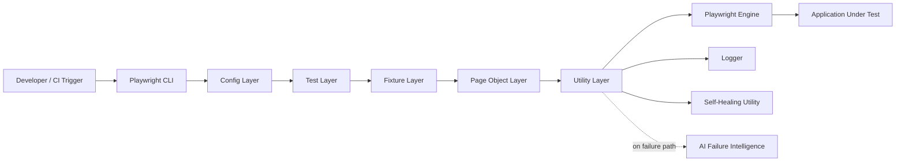
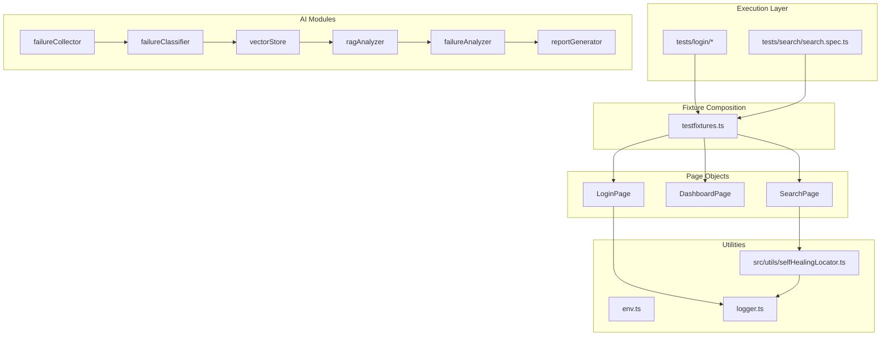
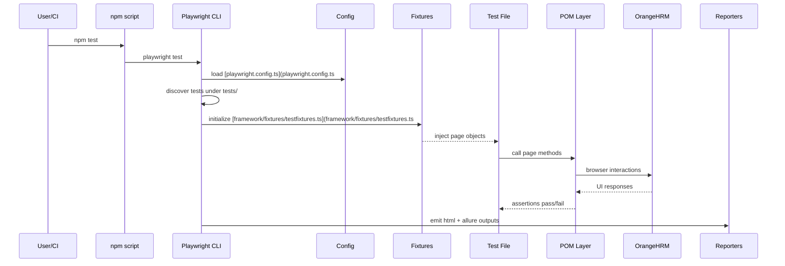
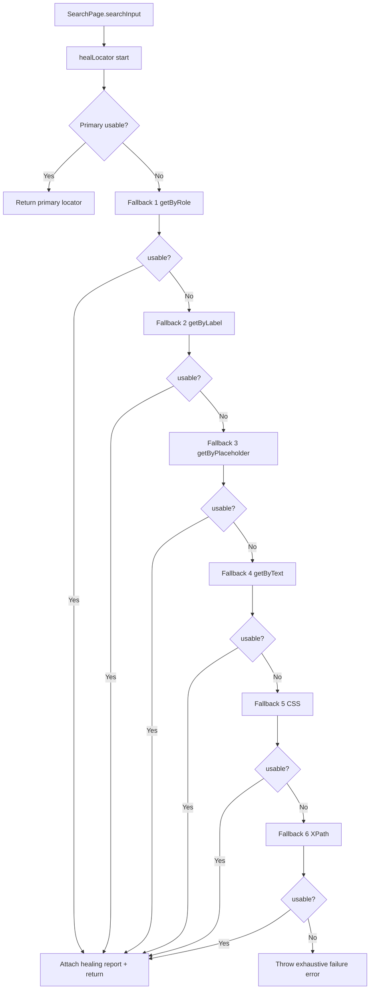
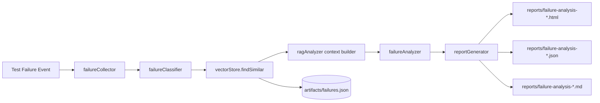
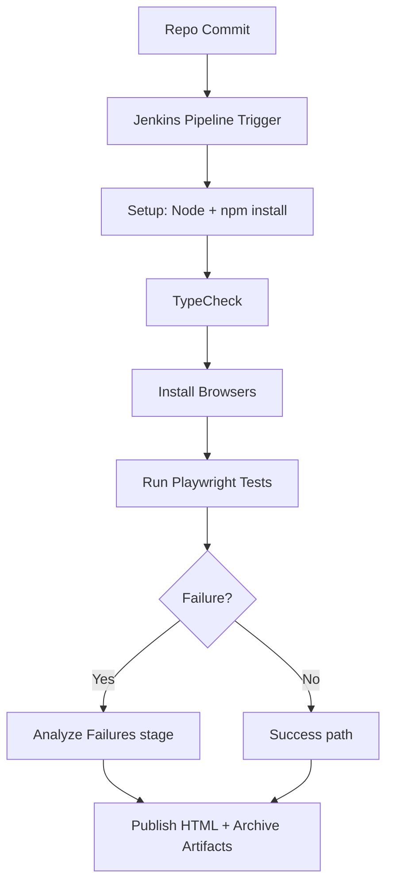
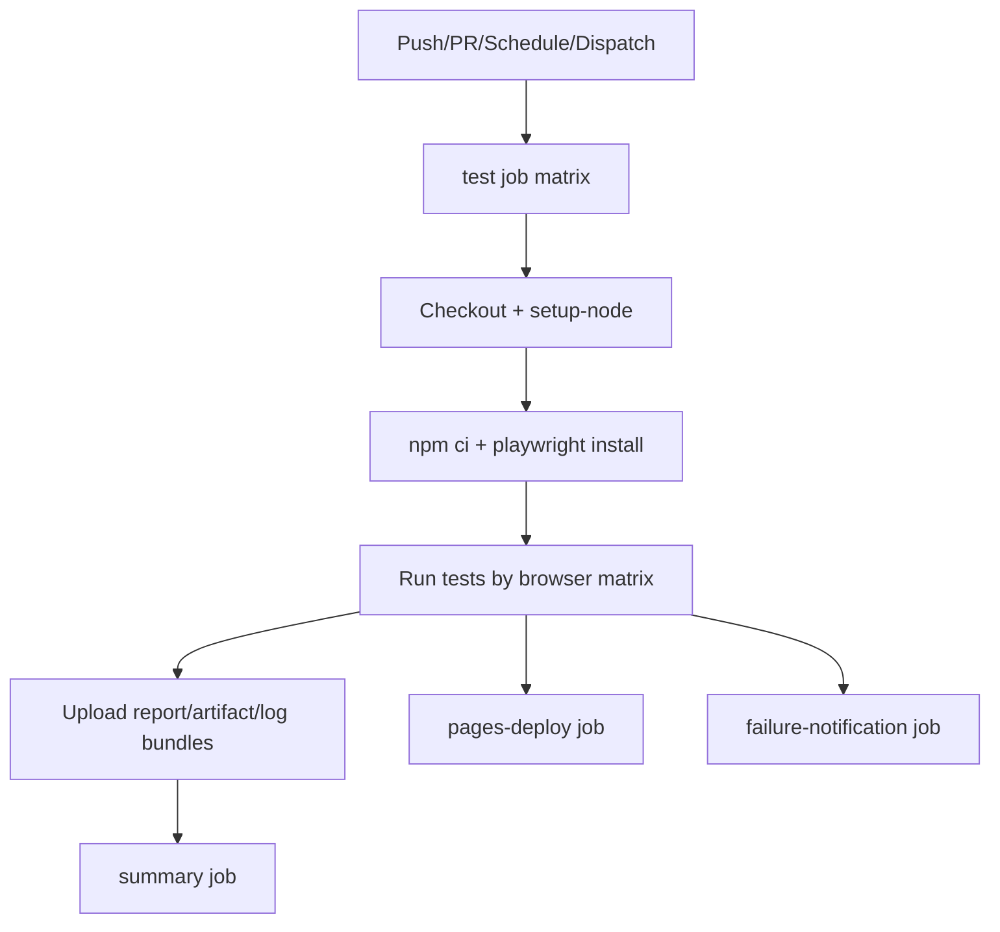

# goCometUI System Design Diagrams

## 1. High-Level Architecture

## 2. Layered Component View

## 3. End-to-End Test Command Flow

## 4. Search Self-Healing Decision Diagram

## 5. AI Failure Analysis Architecture

## 6. CI/CD Diagram - Jenkins

## 7. CI/CD Diagram - GitHub Actions

## 8. Component Interaction Matrix

| Producer | Consumer | Interface | Purpose |
|---|---|---|---|
| tests/search/search.spec.ts | SearchPage | searchAndVerify | Search scenario orchestration |
| SearchPage | healLocator | function call | Runtime locator recovery |
| healLocator | Playwright Locator API | count/isVisible/isEnabled | Candidate validation |
| failureCollector | ragAnalyzer/failureAnalyzer | FailureArtifact model | Failure context handoff |
| vectorStore | ragAnalyzer | findSimilar | Retrieve historical examples |
| failureAnalyzer | reportGenerator | RootCauseAnalysis | Convert analysis to outputs |

## 9. Code Reference Index
- Search page object: [framework/pages/searchPage.ts](framework/pages/searchPage.ts#L4)
- Active self-healing: [src/utils/selfHealingLocator.ts](src/utils/selfHealingLocator.ts#L65)
- Legacy self-healing cache implementation: [framework/utils/selfHealingLocator.ts](framework/utils/selfHealingLocator.ts#L65)
- Fixture composition: [framework/fixtures/testfixtures.ts](framework/fixtures/testfixtures.ts#L16)
- Failure analyzer entry: [framework/ai/failureAnalyzer.ts](framework/ai/failureAnalyzer.ts#L25)
- Report generation entry: [framework/ai/reportGenerator.ts](framework/ai/reportGenerator.ts#L39)
