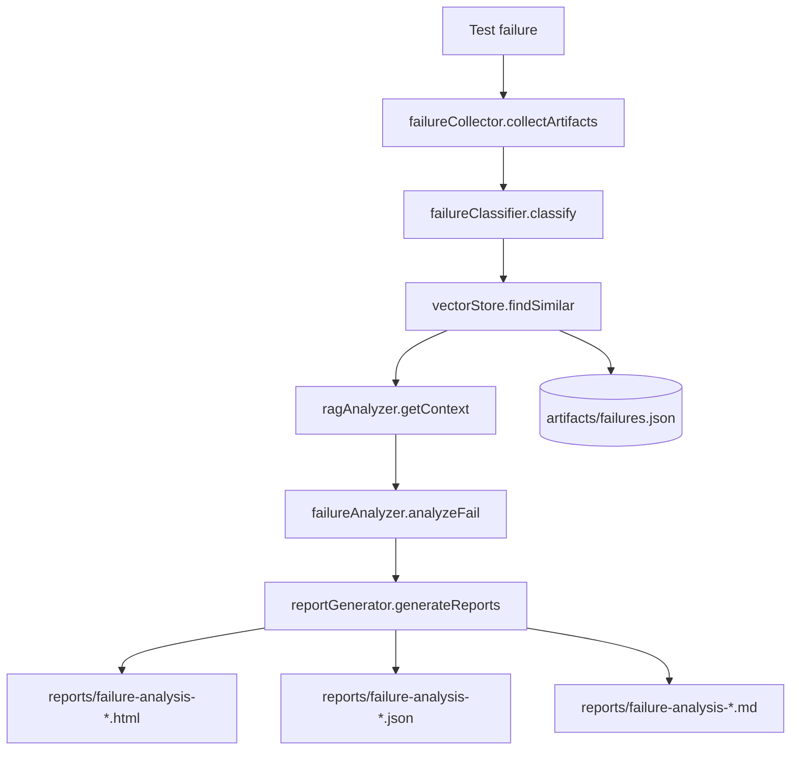
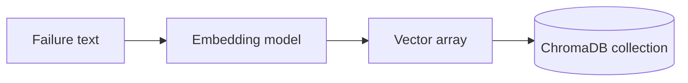
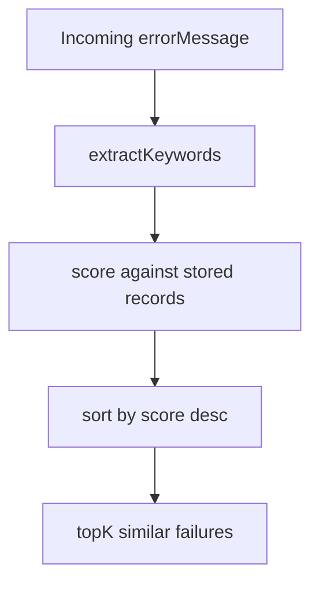
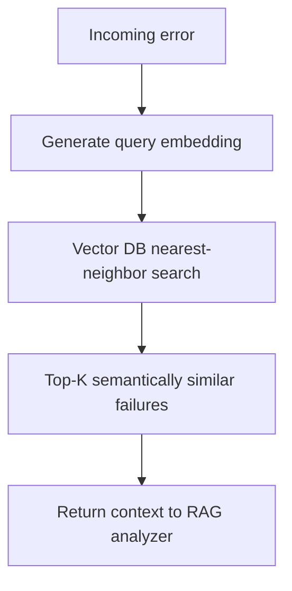
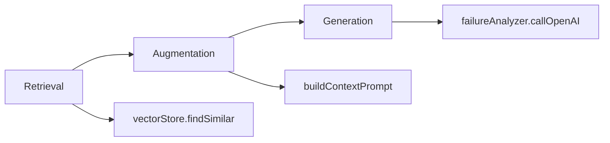
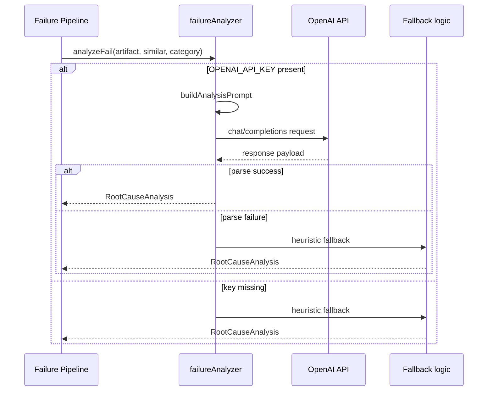
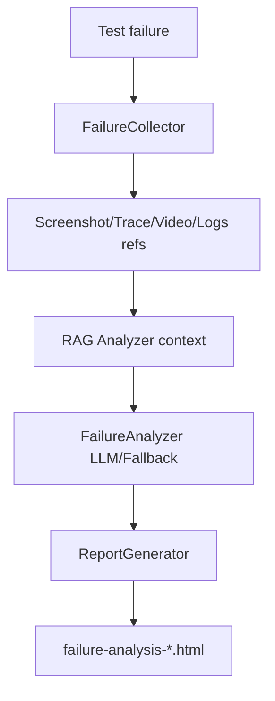

# RAG + LLM + Vector Failure Analysis Design

## 1. Scope

This document analyzes the failure intelligence subsystem in framework/ai and its intended runtime architecture.

Analyzed files:
- [framework/ai/failureCollector.ts](#L22)
- [framework/ai/failureClassifier.ts](#L18)
- [framework/ai/vectorStore.ts](#L22)
- [framework/ai/ragAnalyzer.ts](#L10)
- [framework/ai/failureAnalyzer.ts](#L18)
- [framework/ai/reportGenerator.ts](#L22)

## 2. End-to-End Failure Intelligence Architecture

## 3. Module-by-Module Design

## 3.1 FailureCollector

File: [framework/ai/failureCollector.ts](#L22)

Purpose:
- Normalize and persist failure artifacts with metadata.

Key model:
- FailureArtifact interface in [framework/ai/failureCollector.ts](#L5)

Entry method:
- collectArtifacts in [framework/ai/failureCollector.ts](#L39)

Workflow:
1. Build artifact from error + supplemental paths/logs.
2. Enrich with platform/environment metadata.
3. Persist to artifacts/failures/*.json.

## 3.2 FailureClassifier

File: [framework/ai/failureClassifier.ts](#L18)

Purpose:
- Categorize failure text into operationally useful classes.

Entry method:
- classify in [framework/ai/failureClassifier.ts](#L23)

Decision order:
1. locator
2. timing
3. network
4. auth
5. environment
6. test-data
7. assertion
8. application defect
9. unknown

Pattern detectors:
- isLocatorFailure [framework/ai/failureClassifier.ts](#L85)
- isTimingIssue [framework/ai/failureClassifier.ts](#L102)
- isNetworkFailure [framework/ai/failureClassifier.ts](#L116)
- isAuthFailure [framework/ai/failureClassifier.ts](#L144)

## 3.3 VectorStore

File: [framework/ai/vectorStore.ts](#L22)

Purpose:
- Persist historical failures and support similarity retrieval.

Current implementation:
- JSON-backed local store with keyword overlap scoring.

Methods:
- addFailure [framework/ai/vectorStore.ts](#L63)
- findSimilar [framework/ai/vectorStore.ts](#L82)
- updateFailure [framework/ai/vectorStore.ts](#L106)

Stored fields:
- id, timestamp, testName, errorMessage, category, optional rootCause, suggestedFix, confidence.

## 3.4 RAGAnalyzer

File: [framework/ai/ragAnalyzer.ts](#L10)

Purpose:
- Retrieve similar failures and build contextual prompt segment.

Methods:
- getContext [framework/ai/ragAnalyzer.ts](#L15)
- buildContextPrompt [framework/ai/ragAnalyzer.ts](#L38)

Workflow:
1. Query vectorStore.findSimilar on current error.
2. Build prompt that merges current incident with historical cases.
3. Return context + similar record set.

## 3.5 FailureAnalyzer

File: [framework/ai/failureAnalyzer.ts](#L18)

Purpose:
- Generate root-cause analysis using LLM when available, otherwise heuristic fallback.

Methods:
- analyzeFail [framework/ai/failureAnalyzer.ts](#L25)
- callOpenAI [framework/ai/failureAnalyzer.ts](#L58)
- buildAnalysisPrompt [framework/ai/failureAnalyzer.ts](#L172)

Inputs:
- FailureArtifact
- Similar failures
- Classified category

Outputs:
- RootCauseAnalysis object with rootCause/category/confidence/suggestedFix/owner.

Behavior:
- If OPENAI_API_KEY missing, fallback analysis path executes.
- If response parse fails, text fallback branch executes.

## 3.6 ReportGenerator

File: [framework/ai/reportGenerator.ts](#L22)

Purpose:
- Materialize final human and machine readable reports.

Method:
- generateReports [framework/ai/reportGenerator.ts](#L39)

Outputs:
- HTML detailed report.
- JSON structured artifact.
- Markdown summary.

## 4. Vector Database Analysis

Important architecture reality:
- package.json includes chromadb dependency.
- Current vectorStore implementation is local JSON + keyword similarity.

### Why ChromaDB is mentioned
- For future semantic embedding retrieval at scale.
- For cosine similarity over vector embeddings rather than keyword overlap.

### What data is stored now
- FailureRecord objects in artifacts/failures.json.

### Embedding workflow (future target)

### Retrieval workflow (current)

### Similarity search workflow (future with ChromaDB)

## 5. RAG Workflow

Detailed execution:
1. Retrieval
   - Query similar failures from vectorStore using current error text.
2. Augmentation
   - Combine current failure details with historical root causes and fixes.
3. Generation
   - LLM returns structured JSON-like analysis payload.

## 6. LLM Failure Analysis Sequence

## 7. Failed Test to HTML Report Flow

## 8. Runtime Integration Note

Current state:
- AI module set is implemented.
- Automatic invocation hook is not present in [framework/fixtures/testfixtures.ts](#L16) yet.

Implication:
- Architecture is ready, but full pipeline execution depends on wiring in test lifecycle hooks.

## 9. Interview-Ready Talking Points

- Clear separation of concerns across collection, classification, retrieval, generation, and reporting.
- Graceful degradation path ensures analysis still returns actionable output when LLM is unavailable.
- Current local vector strategy is lightweight and deterministic; ChromaDB can be introduced behind existing interface without breaking callers.
