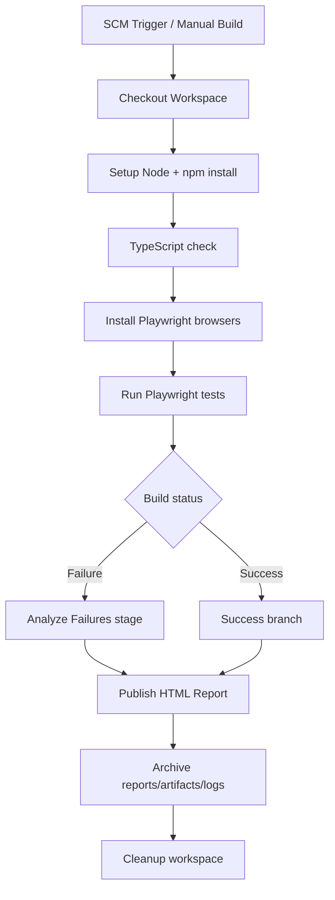
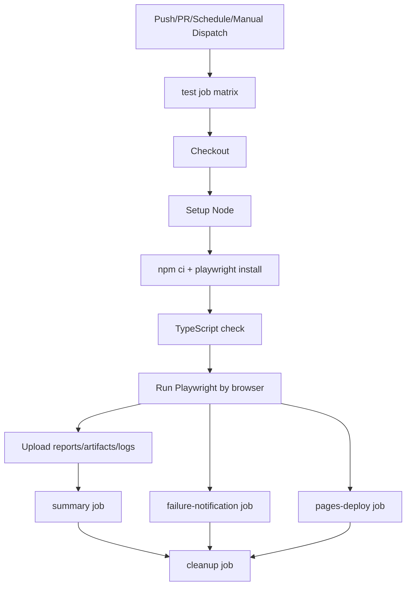
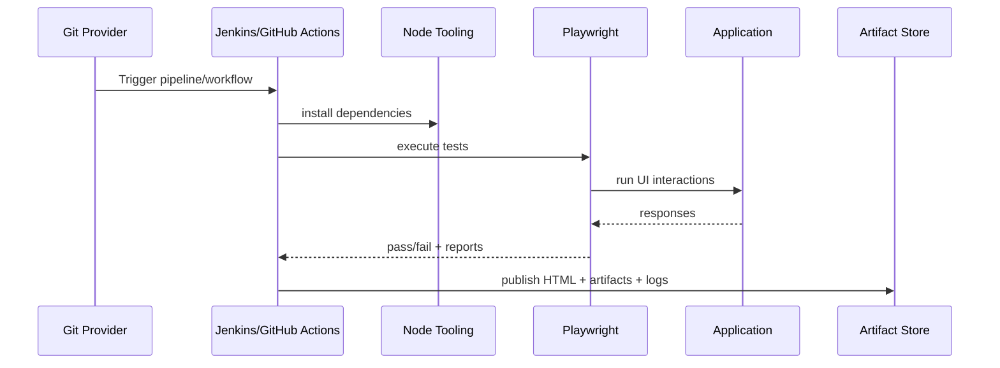
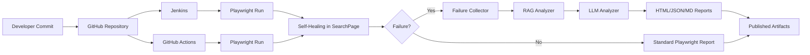

# CI/CD Architecture - goCometUI

## 1. Scope

This document describes CI/CD execution architecture for goCometUI using Jenkins and GitHub Actions, including where Playwright execution and failure-analysis artifacts fit.

Primary references:
- [Jenkinsfile](#L1)
- [.github/workflows/test.yml](#L1)
- [playwright.config.ts](#L17)

## 2. Jenkins Architecture

## 2.1 Pipeline structure

Reference file: [Jenkinsfile](#L1)

Stages:
1. Setup
2. Type Check
3. Install Browsers
4. Run Tests [Jenkinsfile](#L68)
5. Analyze Failures (conditional) [Jenkinsfile](#L89)
6. Post actions: publish and archive artifacts [Jenkinsfile](#L129)

## 2.2 Jenkins flow diagram

## 2.3 Artifact publishing model

Publish/Archive operations include:
- Playwright HTML report.
- Test screenshots/videos.
- reports/failure-analysis-* outputs.
- artifacts/*.json.
- logs/*.json.

References:
- [Jenkinsfile](#L129)
- [Jenkinsfile](#L145)

## 2.4 Environment and secret model

- CI flag and log level configured in environment block.
- OPENAI_API_KEY resolved from Jenkins credentials binding.

Reference:
- [Jenkinsfile](#L17)

## 3. GitHub Actions Architecture

## 3.1 Workflow structure

Reference: [.github/workflows/test.yml](#L1)

Jobs:
- test matrix by browser [test.yml](#L38)
- summary [test.yml](#L135)
- failure-notification [test.yml](#L159)
- pages-deploy [test.yml](#L209)
- cleanup [test.yml](#L284)

Triggers:
- push, pull_request, schedule, workflow_dispatch.

## 3.2 GitHub Actions flow diagram

## 3.3 Matrix strategy

Current matrix:
- chromium
- firefox
- webkit

Reference:
- [.github/workflows/test.yml](#L46)

Impact:
- Cross-browser confidence.
- Independent artifact set per browser.

## 3.4 Artifact strategy

Uploads on always() for each matrix run:
- playwright-report
- failure analysis reports
- test-results
- artifacts
- logs

Reference:
- [.github/workflows/test.yml](#L87)
- [.github/workflows/test.yml](#L96)

## 4. CI/CD + Playwright Runtime Integration

## 5. Failure Analysis Integration Point

Desired operational chain:
1. Test failure occurs in Playwright.
2. AI modules collect/classify/analyze.
3. reportGenerator emits failure-analysis artifacts.
4. CI archive step picks generated files.

Current architecture status:
- CI archive and upload paths are configured.
- AI invocation should be guaranteed in test lifecycle before post-upload step.

## 6. Jenkins vs GitHub Actions Comparison

| Capability | Jenkins | GitHub Actions |
|---|---|---|
| Execution model | Declarative pipeline stages | Job DAG with matrix |
| Browser strategy | parameterized or all | explicit matrix |
| Artifact handling | archiveArtifacts + publishHTML | upload-artifact |
| Notifications | pipeline post blocks | dedicated failure-notification job |
| Report hosting | Jenkins HTML plugin pages | optional GitHub Pages deployment |

## 7. End-to-End Architecture Illustration

## 8. Architecture Review Notes

Strengths:
- Multi-platform CI pipelines already defined.
- Artifact publication is comprehensive.
- Cross-browser validation path exists in GitHub Actions.

Gaps:
- Need guaranteed runtime hook so AI analysis outputs are always produced before CI artifact upload.
- Duplicate workflow files may require standardization to one source of truth.

## 9. Recommended CI Hardening Actions

1. Add mandatory step that verifies expected report files exist and logs warning when absent.
2. Wire AI analysis invocation into fixture `afterEach` hook.
3. Add retention policy governance for artifacts/reports/logs volume.
4. Add branch protection requiring successful matrix test job.
