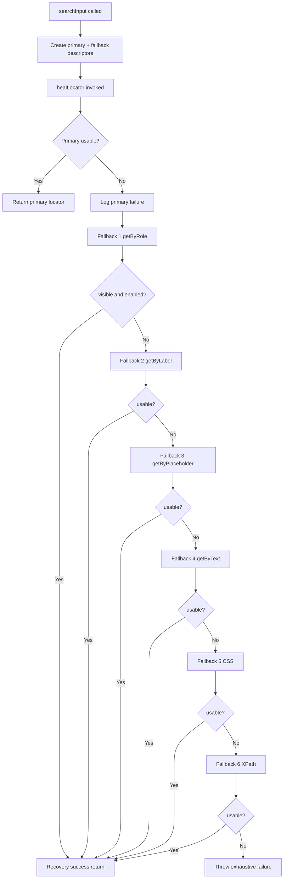
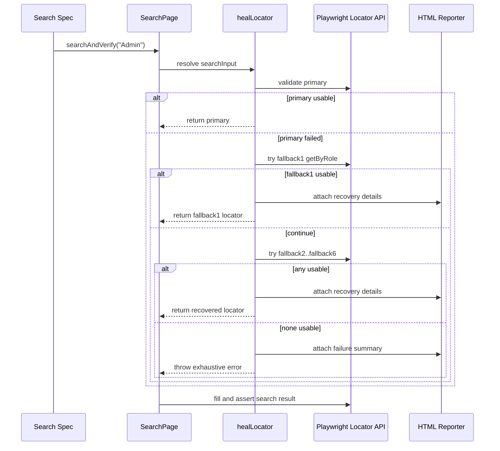

# Locator Strategy Analysis - goCometUI

## 1. Scope

This document analyzes locator strategies currently implemented across the UI framework, with focus on fallback and recovery behavior.

Primary references:
- [framework/pages/LoginPage.ts](#L4)
- [framework/pages/DashboardPage.ts](#L3)
- [framework/pages/searchPage.ts](#L4)
- [framework/utils/selfHealingLocator.ts](#L199)

## 2. Locator Strategy Inventory

## 2.1 LoginPage strategy

File: [framework/pages/LoginPage.ts](#L4)

Pattern:
- Direct attribute selectors with first-element narrowing.

Implemented locators:
- Username: [framework/pages/LoginPage.ts](#L15)
- Password: [framework/pages/LoginPage.ts](#L25)
- Submit button: [framework/pages/LoginPage.ts](#L31)
- Invalid login message: [framework/pages/LoginPage.ts](#L37)

Advantages:
- Fast and stable where attributes are consistent.
- Low complexity and easy readability.

Limitations:
- No runtime fallback chain if attributes drift.

## 2.2 DashboardPage strategy

File: [framework/pages/DashboardPage.ts](#L7)

Pattern:
- Playwright locator chaining with .or for alternate DOM paths.

Chain:
1. getByRole heading Dashboard
2. css h6 breadcrumb module
3. css breadcrumb module class

Advantages:
- Built-in alternate candidate fallback for selector resolution.

Limitations:
- .or chain does not provide explicit per-candidate logging and performance metrics.

## 2.3 SearchPage strategy (active self-healing path)

File: [framework/pages/searchPage.ts](#L19)

Pattern:
- External self-healing function call with explicit ordered fallback descriptors.

Fallback order:
1. getByRole [framework/pages/searchPage.ts](#L26)
2. getByLabel [framework/pages/searchPage.ts](#L31)
3. getByPlaceholder [framework/pages/searchPage.ts](#L35)
4. getByText [framework/pages/searchPage.ts](#L39)
5. locator css [framework/pages/searchPage.ts](#L43)
6. locator xpath [framework/pages/searchPage.ts](#L47)

Primary locator:
- input placeholder Search [framework/pages/searchPage.ts](#L22)

Recovery engine:
- healLocator in [framework/utils/selfHealingLocator.ts](#L199)

## 3. Fallback Locator Runtime Execution

## 3.1 Decision flow

## 3.2 Validation rules

Active checks in [framework/utils/selfHealingLocator.ts](#L259):
- locator.count > 0
- locator.isVisible
- locator.isEnabled

If any check fails, candidate is rejected and next fallback is attempted.

## 4. Logging and Reporting Behavior

Console and CI logging:
- Timestamped logs emitted by process stdout writer in [framework/utils/selfHealingLocator.ts](#L215).

Playwright HTML report attachments:
- Recovery detail attach in [framework/utils/selfHealingLocator.ts](#L275).
- Failure summary attach in [framework/utils/selfHealingLocator.ts](#L279).

Included fields:
- Failed Locator
- Recovered Using
- Recovery Method
- Recovery Duration

## 5. Before vs After Strategy Comparison

| Dimension | Before search self-healing | After search self-healing |
|---|---|---|
| Search locator behavior | Single direct locator, fragile on DOM drift | Primary plus six ordered fallbacks |
| Recovery logs | Minimal | Structured per-fallback logs with timestamps |
| Report visibility | Failure only | Recovery attachment in HTML report |
| CI observability | Basic step logs | Explicit self-healing path in console output |

## 6. Locator Strategy Sequence Diagram

## 7. Advantages and Limitations

Advantages:
- Search test resilience improves without changing global locator behavior.
- Runtime recovery remains deterministic and transparent.
- CI logs provide direct evidence of fallback path taken.

Limitations:
- Scope currently limited to SearchPage only.
- getByText fallback can be broad if page contains multiple search-like texts.

## 8. Recommended Hardening

1. Consolidate to a single canonical self-healing utility path.
2. Add optional timeout budget per fallback to bound worst-case latency.
3. Add selector specificity scoring to prefer semantic matches over broad text matches.
4. Add metric counters for healed-versus-primary success rate over builds.
