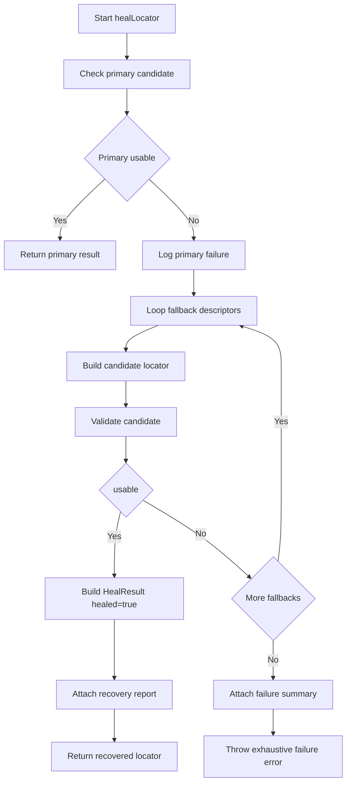
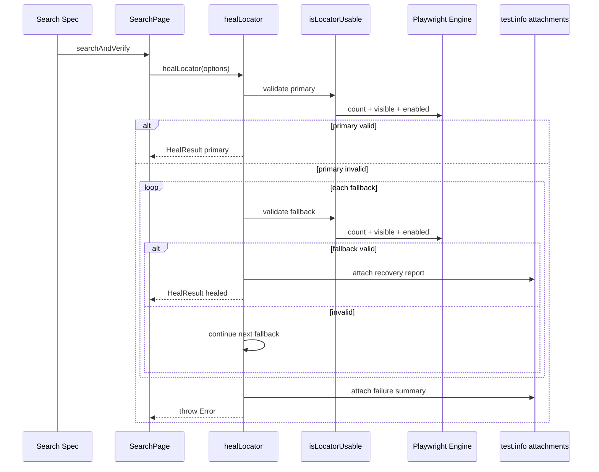
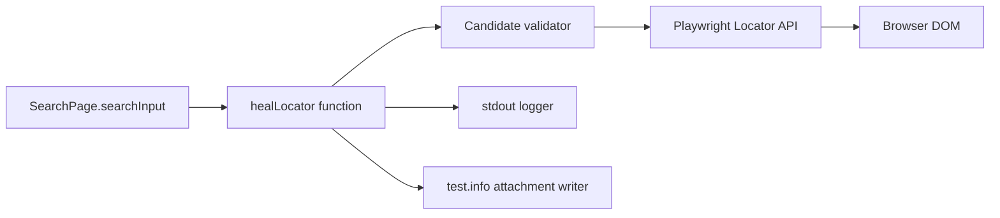

# Self-Healing Locator Design - Search Flow

## 1. Design Scope

This design describes the active runtime self-healing implementation used by SearchPage.

Primary code paths:
- [framework/pages/searchPage.ts](#L19)
- [framework/utils/selfHealingLocator.ts](#L199)

## 2. Architectural Intent

Goal:
- Prevent transient selector drift from failing the Search test when equivalent fallback locators can recover safely.

Non-goals:
- Global framework-wide auto-healing across all pages.
- Silent masking of complete element unavailability.

Design properties:
- Deterministic fallback order.
- Explicit candidate validation.
- Observability through logs and report attachment.
- Hard failure when all strategies fail.

## 3. Components

### 3.1 Caller component

File: [framework/pages/searchPage.ts](#L19)

Responsibilities:
- Build options object with:
  - logical name
  - primary locator
  - primary description
  - ordered fallback descriptors
- Invoke healLocator and consume resolved locator.

### 3.2 Healing engine component

File: [framework/utils/selfHealingLocator.ts](#L199)

Responsibilities:
- Evaluate primary candidate usability.
- Iterate fallback array in order.
- Validate each candidate via count/visible/enabled.
- Emit runtime logs and report attachments.
- Throw exhaustive error if unresolved.

### 3.3 Validation component

File: [framework/utils/selfHealingLocator.ts](#L259)

Rule set:
- count > 0
- isVisible is true
- isEnabled is true

### 3.4 Reporting component

File: [framework/utils/selfHealingLocator.ts](#L275)

Outputs:
- Text attachment in Playwright report containing:
  - Locator Name
  - Failed Locator
  - Recovered Using
  - Recovery Method
  - Recovery Duration

## 4. Decision Tree

## 5. Retry Strategy and Fallback Ordering

Current ordering in [framework/pages/searchPage.ts](#L24):
1. getByRole textbox with search name
2. getByLabel search
3. getByPlaceholder search
4. getByText search
5. css class oxd-input
6. xpath placeholder contains Search

Rationale:
- Prioritize semantic accessibility locators first.
- Move to less semantic CSS/XPath only after semantic candidates fail.

No implicit retry loops:
- Each candidate evaluated once per invocation.
- Decision remains predictable and bounded.

## 6. Logging Strategy

Mechanism:
- process stdout lines with ISO timestamps [framework/utils/selfHealingLocator.ts](#L215).

Emitted events:
- Primary resolved
- Primary failed
- Fallback i started
- Fallback i rejected
- Recovery success with method
- Exhaustion failure summary

Operational impact:
- Visible in local console output.
- Captured in CI step logs automatically.

## 7. Runtime Sequence

## 8. Component Diagram

## 9. Line-by-Line Execution Walkthrough

Entry and options parsing:
- Function declaration in [framework/utils/selfHealingLocator.ts](#L199)
- Option destructuring and timer start in [framework/utils/selfHealingLocator.ts](#L203)

Primary check path:
- Primary usability call [framework/utils/selfHealingLocator.ts](#L207)
- Success fast-return block [framework/utils/selfHealingLocator.ts](#L209)

Fallback path:
- Primary failure log lines [framework/utils/selfHealingLocator.ts](#L224)
- Fallback loop [framework/utils/selfHealingLocator.ts](#L228)
- Candidate build and usability check [framework/utils/selfHealingLocator.ts](#L236)
- Recovery result composition [framework/utils/selfHealingLocator.ts](#L239)
- Recovery attach call [framework/utils/selfHealingLocator.ts](#L259)

Exhaustion path:
- Exhaustive message construction [framework/utils/selfHealingLocator.ts](#L266)
- Failure attachment [framework/utils/selfHealingLocator.ts](#L275)
- Final throw [framework/utils/selfHealingLocator.ts](#L286)

Validator internals:
- Count check [framework/utils/selfHealingLocator.ts](#L259)
- Visibility and enabled checks [framework/utils/selfHealingLocator.ts](#L267)

## 10. Design Advantages and Tradeoffs

Advantages:
- Runtime recovery without broad framework mutation.
- Explicit observability for architecture reviews and demos.
- Controlled fail-fast when no safe candidate is available.

Tradeoffs:
- Added resolution latency when primary fails.
- Candidate quality is only as strong as descriptor design.
- Search coverage is currently the only adopted consumer path.

## 11. Suggested Next Enhancements

1. Add optional telemetry sink for healed counts per build.
2. Add candidate timeout budget per attempt.
3. Introduce fallback confidence scoring and best-first strategy.
4. Adopt the same API in additional page objects where drift risk is high.
